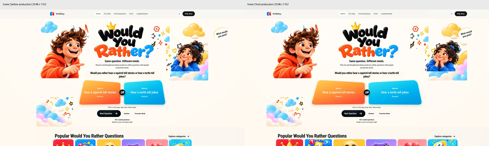
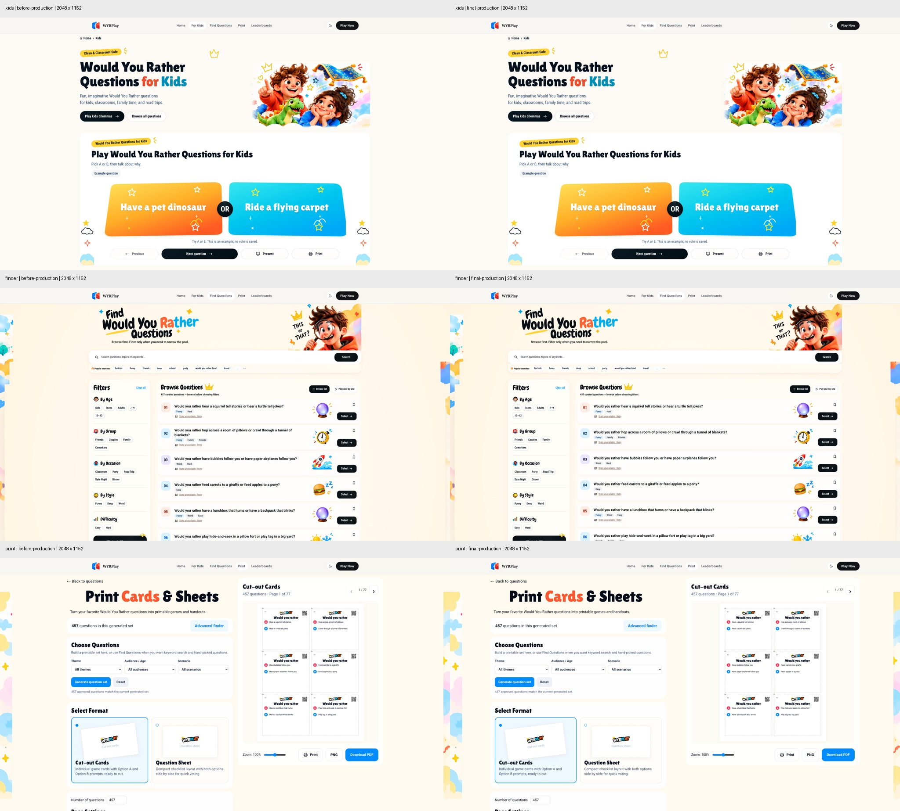
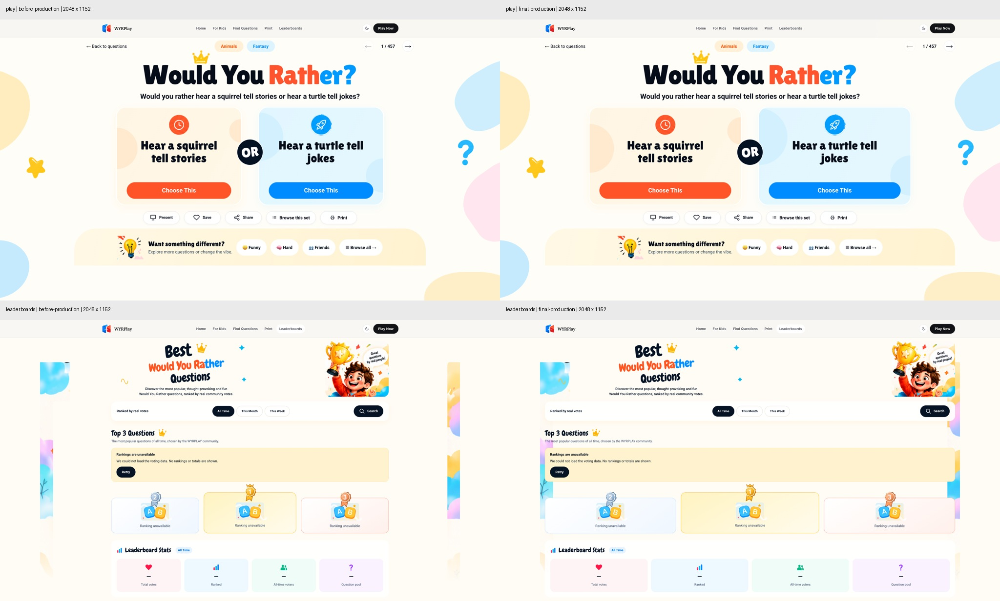
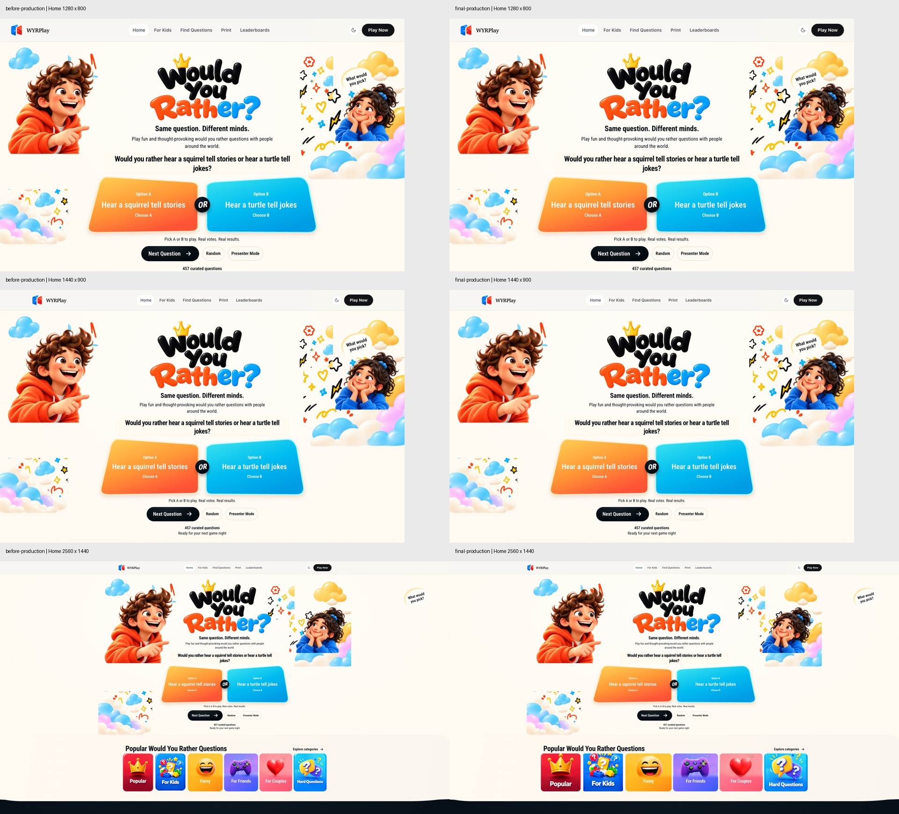
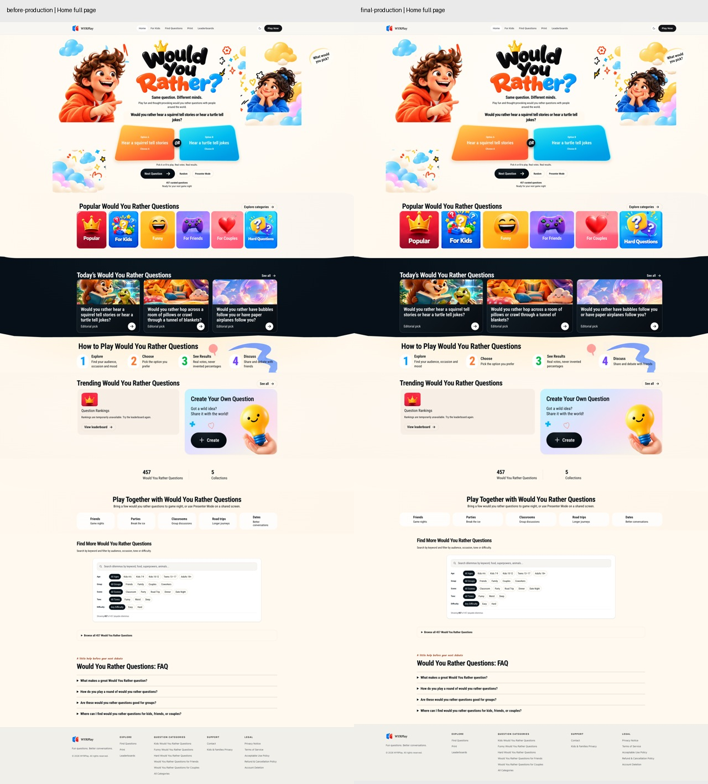

# WYRPlay Wide-screen Layout Regression Fix — 2026-10-07

Base main: `4668c6e619dd8dffe18ba07641d1e288abdfa418` (PR #40).
Branch: `fix/wide-screen-layout`.

The original checkout was clean before and after fetching, checking out main, and pulling with `--ff-only`. This task uses `/Users/milushangdi/.codex/worktrees/wide-screen-layout/wyrplay`. No other active Codex editor was visible for this repository. Deployment and question-bank review chats were active, but their filesystem activity could not be confirmed; the independent checkout avoids sharing edited files with them.

## Layout changes

New global tokens: wide 1680px, card/productivity grid 1520px, readable content 1320px, safe gutter `clamp(24px, 3vw, 48px)`. New wide rules begin at 1441px. Existing laptop, tablet and mobile rules remain in effect through 1440px. Full-bleed section backgrounds retain their current width and appearance.

Measured container widths at 2048×1152 (CSS pixels):

| Surface | Before | After | Controlled content |
| --- | ---: | ---: | --- |
| Header / Footer | 1280 | 1680 | Shared token and gutter, safe margins |
| Home decoration stage | 1440 | 1680 | Image widths and Hero height unchanged; edge anchors move outward |
| Home category/card grids | 1240 including 80px padding | 1520 | Existing art and typography units retained |
| Home arena | 720 | 920 | `clamp(720px, 48vw, 920px)`; central heading stays 620px |
| Home FAQ | 1240 | 1320 | Paragraphs retain their 760px cap |
| Kids hero / browse / arena / related | 1320 | 1520 | FAQ/uses 1320px; choices 1100px; hero image 540px; copy 560px |
| Finder directory | 1240 | 1520 | Sidebar 280px; results 932 → 1212px; about retains 1240px and 75ch paragraphs |
| Print workspace | 1440 (sheet 1445) | 1680 | Editor ~756 → 800px; preview ~662 → 788px; two-column hierarchy retained |
| Play toolbar / discovery | 1340 / 1440 | 1680 | Answer pair 1096 → 1320px; option text keeps 400px cap |
| Leaderboard shell | 1200 including 64px padding | 1680 | Podium/cards/stats receive space; illustration size and heading/copy retained |
| SEO landing card/table grids | 1024 | 1520 | FAQ, SEO text, hero copy and final CTA keep their original narrower containers |

Latest main uses separate Retina Hero images, rather than the legacy composite background. This patch changes their stage/edge positioning without changing the files, intrinsic ratio, character size, or title size. Only category/highlight `sizes` hints were updated so the expanded grids request adequate existing image resolutions.

The Play answer rule is restricted to the normal `.illustrated-arena`; nested Presenter options retain their own 2K/4K/projection layout. Print document/export dimensions and inner form field grids are unchanged.

The audit ledger reconciles 19 reviewed constraint groups: 19 approved/preserved decisions, 0 deferred audit items, 0 deletes/rejects, 0 unknown. Legal/contact/create/auth forms, private account surfaces, dialogs, text limits, and intentional artwork/export dimensions retain their limits. No whitelist inversion, asset replacement, content deletion or bulk migration was performed.

## Browser evidence

Before: independent production build of the exact base main SHA. After: production build of this branch. Installed Google Chrome, headless, DPR 1. Each of Home, Kids, Finder, Print, Play and Leaderboards was loaded and captured at:

- 1280×800, 1440×900, 1920×1080, 2048×1152, 2560×1440.
- Additional regression sizes: 390×844, 768×1024, 1024×768, 1366×768.

54 before and 54 after observations reconcile. All after document/body scroll widths are at most the viewport width (1px tolerance). All recorded container widths at ≤1440px match baseline. Home Hero, card grids, full-page section composition, and the six 2048px surfaces were visually inspected. No new overlap, stretched image, button displacement or Hero height change was observed. Additional wide route checks cover `/questions`, all four other SEO collections, privacy, contact, create, sign-in and sign-up at 2048 and 2560 (20 observations, no overflow). Existing route smoke also covers the other public legal/auth surfaces at mobile/tablet/desktop.

Raw local layout-shift observations are retained in `viewport-metrics.json`; these are not field Web Vitals or a Lighthouse score. Home's existing raw shift totals at 1920/2048/2560 were identical before/after (0.166/0.218/0.227). Kids, Finder, Play and Print wide observations were 0. Leaderboard observations varied with its asynchronous unavailable state (before up to 0.036, after up to 0.040). No clear new desktop CLS increase was observed; existing Home shifts were not changed in this layout-only task.

The local database address is intentionally unavailable. Screenshots display real approved source questions and explicit voting/ranking-unavailable states. No ranking totals, votes or success responses were invented. Populated live-database leaderboard rows and vote persistence are not validated by these screenshots.

The comparisons below show baseline on the left and the branch on the right; they are crops/contact sheets of actual production-browser captures.







## Changed source files

- `src/app/globals.css`
- `src/components/navigation/site-header.tsx`
- `src/components/navigation/site-footer.tsx`
- `src/components/landing/landing-page.tsx`
- `src/modules/would-you-rather/ui/illustrated-home.css`
- `src/modules/would-you-rather/ui/illustrated-home.tsx` (image delivery hints only)
- `src/modules/would-you-rather/ui/home-product.css`
- `src/modules/would-you-rather/ui/kids/kids.css`
- `src/modules/would-you-rather/ui/kids/kids-responsive.css`
- `src/modules/would-you-rather/ui/finder/finder-responsive.css`
- `src/modules/would-you-rather/ui/play/print.css`
- `src/modules/would-you-rather/ui/play/play.css`
- `src/modules/would-you-rather/ui/leaderboard/leaderboard.css`

Existing tests updated: `tests/e2e/responsive-layout.spec.ts`, `tests/e2e/finder-layout.spec.ts`. These add 2048px/bounded-width checks, a Kids wide/readable check, and wait for real page containers before measuring streamed pages. No pixel-perfect snapshot suite was added.

Public image files, question bank, SEO copy/configuration, interactions, API/database/auth/payment implementation, dependencies and deployment configuration are unchanged. Verification images and JSON are documentation only, outside public assets.

## Verification results

- `bun run lint`: PASS, 0 errors; 2 existing warnings in `src/app/global-error.tsx`.
- `bun run typecheck`: PASS.
- `bun run test:unit`: PASS, 328 tests / 61 files.
- `bun run test:contract`: PASS, 31 tests.
- `bun run build`: PASS with `APP_ENV=production`, `APP_ORIGIN=https://example.com`, and an explicitly unavailable local database address. No database changes were made.
- Existing related Playwright suites: PASS, 57 tests against the final local production build with installed Chrome. Covers responsive matrices, Finder collisions/DPR1-DPR2 assets, Home, Print/PDF/PNG/QR, fullscreen, 4K Presenter, routing, selection, keyboard/focus and sharing.
- Existing production SEO/sitemap/legal smoke: PASS, 3 tests against the final local production build.
- Changed-file Prettier and `git diff --check`: PASS.

The final browser selection excludes auth-enabled tests and real database voting tests because this runtime has neither enabled test auth nor a disposable database. `bun run test:integration` was attempted separately: 36 database suites could not initialize because `TEST_DATABASE_URL` was absent, while 13 non-database tests passed. They remain unverified. The first-vote persistence and Finder real-stat tests also fail against the untouched baseline with the same unavailable local DB. No mocks were added to turn those failures into successes. This is not a claim that the complete enabled-feature suite or remote CI passed.

Browser runner commands (local launch override uses `channel: "chrome"`, base URL `http://127.0.0.1:3100`; original test source retained):

```sh
bunx playwright test --config .artifacts/wide-screen/playwright.config.ts \
  responsive-layout.spec.ts homepage.spec.ts finder-layout.spec.ts \
  play-print.spec.ts print-closeout.spec.ts kids-closeout.spec.ts \
  site-header-regressions.spec.ts \
  --grep-invert 'Auth fills|auth-enabled|aggregate voting|real choices|selected set survives|first vote before|vote summary renders real stats'
bunx playwright test --config .artifacts/wide-screen/production.config.ts
```

Local raw captures, runner configurations and logs remain in `.artifacts/wide-screen/`; selected comparisons, reconciled geometry and the constraint ledger are committed alongside this report. No merge, live deployment, production database mutation or payment action was performed.
